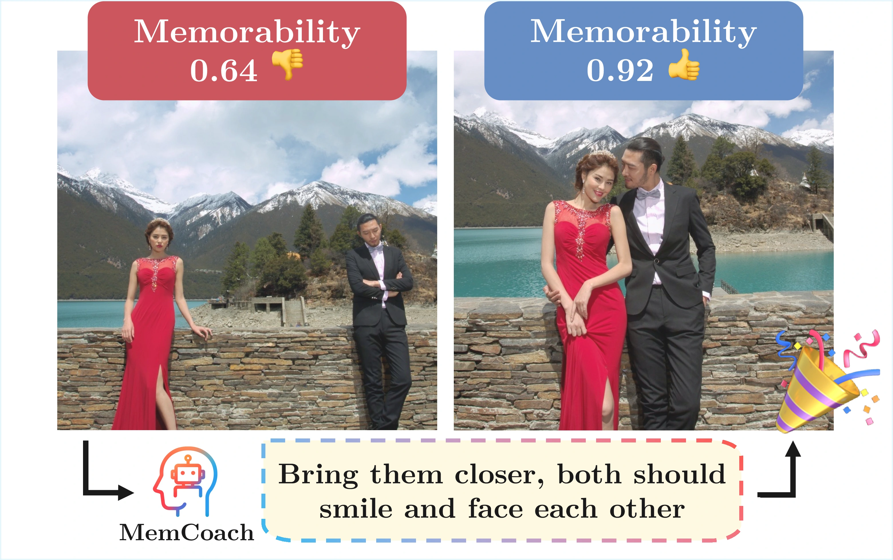

<div align="center">

<a href="https://www.python.org"></a>
<a href="https://pytorch.org/get-started/locally/"></a>
<a href="https://github.com/huggingface/transformers"></a>
<a href="https://arxiv.org/abs/2602.21877"></a>


<div align="center">
    <a href=#setup>Setup</a>
    •
    <a href=#pipeline>Pipeline</a>
    •
    <a href=#interactive-demo >Interactive Demo</a>
    •
    <a href=#reproducing-paper-results >Results</a>
    •
    <a href=#citation >Citation</a>
</div>

</div>

---

<div align="center">

<h1>How to Take a Memorable Picture?<br>Empowering Users with Actionable Feedback</h1>

[Francesco Laiti](https://laitifranz.github.io/), [Davide Talon](https://davidetalon.github.io/), [Jacopo Staiano](https://www.staiano.net/), [Elisa Ricci](https://eliricci.eu/)



</div>


## Updates

- **[Mar 02, 2026]** MemCoach is live!
- **[Feb 28, 2026]** MemBench is live!
- **[Feb 26, 2026]** Arxiv paper is live!


## Setup
### 1. Install dependencies

```bash
# clone project
git clone https://github.com/laitifranz/MemCoach
cd MemCoach

# (recommended) use uv to set up the python version
# and to install the required dependencies
curl -LsSf https://astral.sh/uv/install.sh | sh
# --frozen ensures uv.lock is respected strictly and not modified,
# guaranteeing you get the exact same environment as intended
uv sync --frozen

# (alternative) use pip to install the required dependencies
python3.12 -m venv .venv
source .venv/bin/activate
pip install -e .
```

> [!NOTE] 
For those who are not familiar with uv, `uv run` is a command that activate at runtime the virtual environment while running the command.

### 2. (Optional) Setup environment variables
> You can skip this step if you are not using OpenRouter API or if you are using the default paths.

```bash
# copy .env.example to .env
cp .env.example .env

# edit .env file
vim .env
```

### 3. Download the dataset MemBench

[MemBench](https://huggingface.co/datasets/laitifranz/MemBench) is a benchmark dataset, hosted on HuggingFace, introduced alongside MemCoach.
```bash
uv run hf download --repo-type dataset laitifranz/MemBench --local-dir dataset/
unzip dataset/images.zip -d dataset/ && mv dataset/images dataset/ppr10k # rename the folder to ppr10k
```


## Pipeline

### General information
> [!IMPORTANT]
Launch the scripts from the project root directory.

> [!TIP]
>The repository keeps a portable Python wrapper to activate the virtual environment and set the `PYTHONPATH` to the project root:
>```bash
>bash scripts/schedule_python.sh <PATH_TO_PYTHON_SCRIPT> <ARGUMENTS_FOR_THE_SCRIPT>
>```
>You can also use the following command with `uv` to run the script:
>```bash
>PYTHONPATH=$(pwd) uv run <PATH_TO_PYTHON_SCRIPT> <ARGUMENTS_FOR_THE_SCRIPT>
>```

> [!TIP]
The `scripts` directory contains various utility scripts for job scheduling on SLURM clusters. Use `bash scripts/schedule_sbatch.sh -h` to get more information. Take a look at the examples in the `scripts/slurm_configs` directory to see how to setup a SLURM environment.

---

### Preliminary Stage - Memorability scores generation

Generate the memorability scores with our target predictor model.
```bash
bash scripts/schedule_python.sh src/pipelines/membench_gen/generate_target_scores.py --mlp_checkpoint_path "ckpt/target_predictor/memorability/ours/model_weights.pth"
```

---

### Stage A - Contrastive generation
> [!TIP] 
If you run the scripts on a SLURM environment cluster, you can parallelize the generation by using SLURM array argument. 

> [!NOTE]
The model settings provided in the config files are for the [InternVL3.5-8B](https://huggingface.co/OpenGVLab/InternVL3_5-8B-HF) model. You can change the model settings by editing the config files.

#### A1. Teacher generation (MemBench-style generation)

```bash
bash scripts/schedule_python.sh src/pipelines/membench_gen/constr_data_gen/runner.py --config_path config/data_generation/teacher/internvl3_5_8B.yaml
```

#### A2. Student generation (Zero-shot generation)

```bash
bash scripts/schedule_python.sh src/pipelines/zero_shot/runner.py --config_path config/data_generation/student/internvl3_5_8B.yaml
```

---

### Stage B - Steering vector extraction
#### B1. Positive activation extraction

```bash
bash scripts/schedule_python.sh src/pipelines/method/training.py --config_path config/method_steering/training/internvl3_5_8B_positive.yaml
```

#### B2. Negative activation extraction

```bash
bash scripts/schedule_python.sh src/pipelines/method/training.py --config_path config/method_steering/training/internvl3_5_8B_negative.yaml
```

> [!NOTE]
We provide the pre-built steering vectors for the [InternVL3.5-8B](https://huggingface.co/OpenGVLab/InternVL3_5-8B-HF) model used for the paper experiments in the [ckpt/memcoach](ckpt/memcoach) directory. You can use them to skip the activation extraction stage.

---

### Stage C - MemCoach inference

Run inference using the exact activation files produced in Stage B:

```bash
bash scripts/schedule_python.sh src/pipelines/method/inference.py # add --config-name config_paper to use our steering pre-built vectors
```
> [!TIP]
> By default, Hydra will use the `config/method_steering/inference/config.yaml` file pointing to `config/method_steering/inference/internvl3_5_8B.yaml`. You can override the key dicts in the config file by passing them as arguments to the script, e.g.:
> ```bash
>bash scripts/schedule_python.sh src/pipelines/method/inference.py activation_settings.coeff=55 activation_settings.target_layer=12 runtime.include_datetime=true
>```

---

### Run the editing evaluation pipeline

Based on the editing evaluation you want to perform, you can choose the appropriate config file. We provide config files for the flux baseline, teacher oracle, zero-shot, and MemCoach editing evaluation.

- For the MemCoach evaluation:
```bash
bash scripts/schedule_python.sh src/pipelines/evaluation/editing/runner.py --config_path config/evaluation/editing/memcoach.yaml
```

---

### Run the analysis pipeline

```bash
bash scripts/schedule_python.sh src/analysis/editing_metrics.py --root experiments/evaluation/editing --run-scope latest
```

## Interactive Demo

> [!NOTE]
> - Since the camera access on mobile devices requires a secure context, we need to use a proxy to forward the requests to the FastAPI server via HTTPS. We use ngrok for this purpose
> - API requests are logged in the `outputs/api_requests` directory. Check [web/camera/README.md](web/camera/README.md) for more information
>- The default steering settings loaded in the MemCoach API are configured in the `config/method_steering/inference/internvl3_5_8B_paper.yaml` file.

#### 1. Open two terminals:

##### 1.1 Get an ngrok authtoken and install ngrok:
```bash
NGROK_AUTHTOKEN=<your_token_here> uvx ngrok http 8000
```

Save the ngrok forward URL for later use.

##### 1.2 Start the FastAPI server:

```bash
PYTHONPATH=$(pwd) uv run -m uvicorn src.api.app:app --host 0.0.0.0 --port 8000
```

#### 2. Connect to the ngrok tunnel from your mobile device via browser:
```bash
https://<your_ngrok_subdomain>.ngrok-free.dev/camera/?api=https://<your_ngrok_subdomain>.ngrok-free.dev
```

#### 3. Enjoy! :tada:


## Reproducing Paper Results

For transparency and reproducibility, we provide our evaluation artifacts for MemCoach on InternVL3.5-8B model. We report the IR and RM metrics.

**Option A — Compact download (recommended):** A single zip archive containing all 4 experiment folders is available to avoid hitting the Hugging Face rate limit:

```bash
uv run hf download --repo-type dataset laitifranz/MemBench-InternVL3.5-Eval MemBench-InternVL3.5-Eval-Artifacts.zip --local-dir artifacts/
unzip artifacts/MemBench-InternVL3.5-Eval-Artifacts.zip -d artifacts/hf_internvl3_5_8B_eval
```

**Option B — Full dataset download (for individual downloads):**

```bash
HF_XET_HIGH_PERFORMANCE=1 uv run hf download --repo-type dataset laitifranz/MemBench-InternVL3.5-Eval --include "teacher_oracle/*" --local-dir artifacts/hf_internvl3_5_8B_eval
```
> [!NOTE]
You may need to resume the download if you hit the Hugging Face rate limit.

Then run the analysis pipeline:
```bash
bash scripts/schedule_python.sh src/analysis/editing_metrics.py --root artifacts/hf_internvl3_5_8B_eval --run-scope latest
```

## Maintenance

```bash
make setup-pre-commit # one-time setup: install pre-commit globally with uv + install git hooks + autoupdate
make check # run pre-commit hooks (format + lint via ruff + security checks via gitleaks)
make clean-logs # clean logs
make run-tests # run tests via pytest
```

## Citation

If you find this work useful to your research, please consider citing as:

```bibtex
@inproceedings{laiti2026memcoach,
  title={How to Take a Memorable Picture? Empowering Users with Actionable Feedback},
  author={Laiti, Francesco and Talon, Davide and Staiano, Jacopo and Ricci, Elisa},
  booktitle={Proceedings of the IEEE/CVF Conference on Computer Vision and Pattern Recognition},
  year={2026}
}
```

## Acknowledgments
Thanks to these great repositories: [dottxt-ai/outlines](https://github.com/dottxt-ai/outlines) to make structured output easy with LLMs, [google/python-fire](https://github.com/google/python-fire) to make CLI management easy, and [PPR10K](https://github.com/csjliang/PPR10K) for the PPR10K dataset.

The needs of this project led to a contribution back to the community: [PR #1728](https://github.com/dottxt-ai/outlines/pull/1728) was merged into `dottxt-ai/outlines`, improving the handling of multimodal chat inputs for Transformers models.


## Disclaimers
Since this project relies a lot on automatic generation of data, the generated feedback can be different due to the stochastic nature of models. We tried to make the pipeline as reproducible as possible, but there might be some variations in the generated feedback using your machine and virtual env setup. See [Reproducing Paper Results](#reproducing-paper-results) for more information.